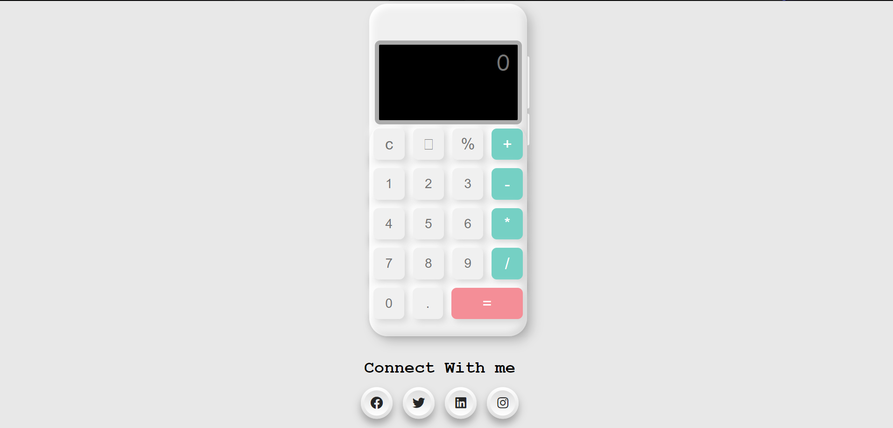

# Name of the Project
- Responsive Digital Calculator (Using Neumorphism)

# About the Project
- I have made this project for the event "7-days of web-development" organised by HackClub ITER
- In this project I have created a simple calculator which is responsive to all types of devices and I have used some neumorphism in it.

# Tech Stack used 
- I have used HTML, CSS, and JavaScript to create this project.

# Motivation for the project
- My main motivation behind creating this project was to use what I have learnt in these 7 days.
- Using HTML, CSS and JavaScript any one can design a website, but I want some more. I have gone a little bit deeper and learnt "Neumorphism" which was new for me. I also have gone a bit deeper into javaScript to gain more idea in order to improve my project.
- And finally I have created a webapp which is a calculator. 

# How our 7 Days of Web Development helped you in making this project?
- Your 7 days of Web Development has really helped me a lot. Earlier I only have studied the conceptss. But the daily learning materials and quiz have helped me a lot in remembering the concepts. Due to the quiz I got the answer to some of my conceptual questions. I also got to know the reason behind the functionality of some things.

# Hosted link
- Link: https://arpanaditya.github.io/hackclub-project/

# How it looks
- Desktop View
 
- Mobile View
 

# Your Name, Registration Number.
- Name: Aditya Arpan Sahoo
- Registration Number: 2041019025
